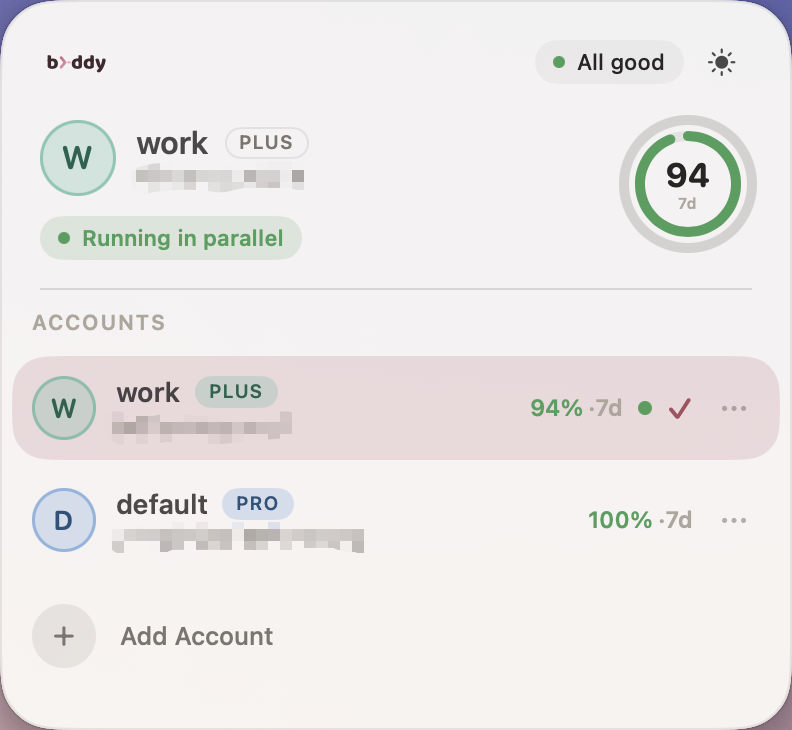
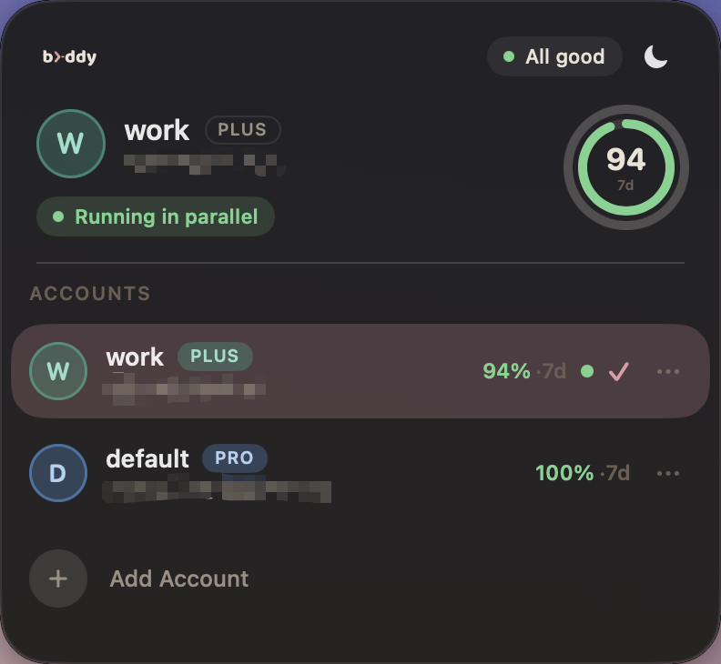
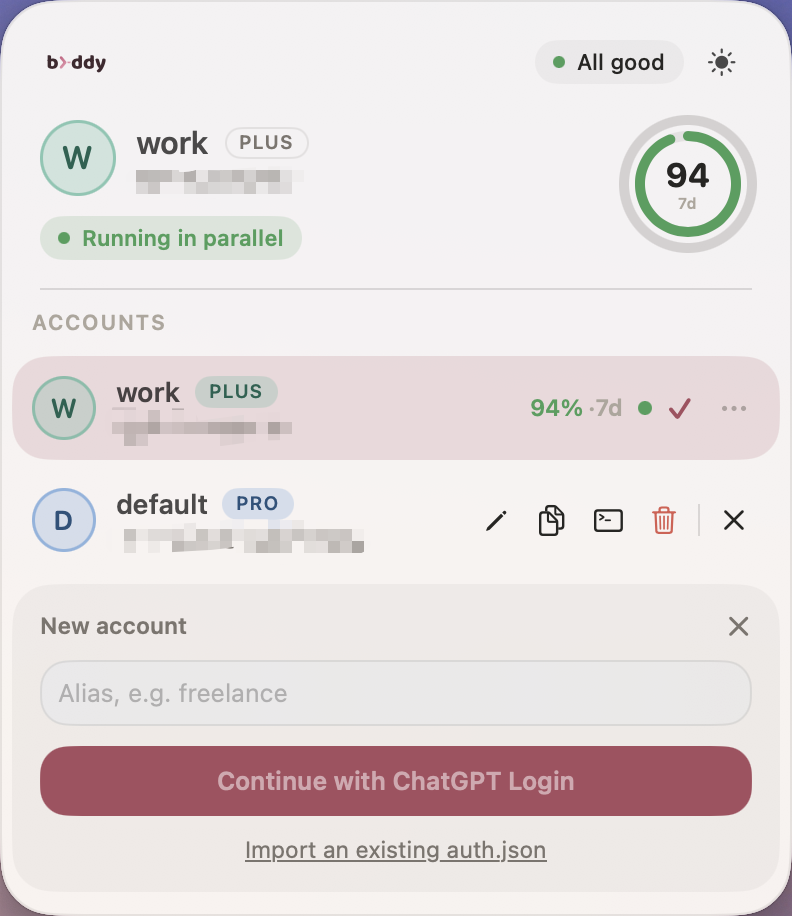

# codex-buddy

[English](README.md) | [简体中文](README.zh-CN.md) | **Español**


Una forma **pequeña y rápida** de ejecutar varias cuentas de
[Codex CLI](https://developers.openai.com/codex) en paralelo — un binario de **461 KB**, cambia o
corre en simultáneo, sin re-logins y sin que nada salga de tu máquina.

## Características

- **Pequeña y rápida** — un único binario de 461 KB, solo 4 dependencias directas, cero async /
  cero HTTP / cero crypto. Cambiar de cuenta es un `rename` atómico (**instantáneo**); detectar qué
  cuentas están corriendo en paralelo usa una syscall nativa (~**2 ms**). El binario de release se
  comprime con `opt-level=z` + `lto` + `strip`.
- **Cuentas realmente en paralelo** — ejecuta dos o más sesiones de Codex **al mismo tiempo**, cada
  una con su propia cuenta, totalmente aisladas.
- **Nunca fuerza un nuevo login** — cambia de cuenta ida y vuelta las veces que quieras, sin
  cierre de sesión forzado ni riesgo de activar la detección de abuso.
- **100% local** — sin telemetría, sin dependencia de la nube, sin ninguna llamada de red; nada
  sale de tu máquina.
- **Segura por diseño** — la configuración inicial respalda tu sesión existente antes de tocarla y
  revierte ante cualquier fallo; un solo comando `doctor` te dice si algo no está bien.
- **Config compartida, logins aislados** — `config.toml` y las reglas aplican a todas las
  cuentas; las credenciales nunca se filtran entre cuentas.

## App en la barra de menú

Además de la CLI, codex-buddy incluye una app nativa en la barra de menú de macOS: haz clic en el
icono y un panel muestra el uso de cada cuenta, cuál está activa y cuáles corren en paralelo — un
clic para cambiar. **Igual de pequeña** — un bundle de una sola arquitectura pesa solo **0.6 MB**.

<p align="center">
  
  
</p>

- **Anillos de uso duales** — mira de un vistazo cuánto queda en las ventanas de 5h / 7d, con color
  según el umbral.
- **Lista de cuentas** — avatar de color propio por cuenta, insignia de plan, punto verde de
  ejecución en paralelo y una marca en la cuenta activa.
- **Doctor integrado** — autochequeo en el propio panel; despliega una lista solo cuando algo está
  mal, con copia del informe en un clic.
- **Claro / oscuro** — sigue al sistema, o alterna claro / oscuro tú mismo (los dos paneles de
  arriba).
- **Acciones en línea + Añadir cuenta** — una fila de iconos por cuenta para renombrar, copiar
  `CODEX_HOME`, ejecutar en Terminal o eliminar; "Add Account" se despliega en el sitio, lanzando un
  `codex login` real o importando un `auth.json` existente.

<p align="center">
  
</p>

- **Elemento de estado en la barra de menú** — mira la cuenta activa y su porcentaje de uso más
  ajustado sin siquiera abrir el panel, con color según el umbral.

<p align="center">
  
</p>

Descarga la app desde [Releases](https://github.com/CodePrometheus/codex-buddy/releases):
`Codex-Buddy-arm64-macOS.zip` para Apple Silicon, `Codex-Buddy-x86_64-macOS.zip` para Intel. No está
firmada, así que la primera vez hay que abrirla con clic derecho → Abrir.

## Instalación

**Homebrew.**

```sh
brew install CodePrometheus/tap/codex-buddy
```

**Script de shell.** Descarga un binario precompilado, sin necesidad de Homebrew:

```sh
curl --proto '=https' --tlsv1.2 -LsSf https://github.com/CodePrometheus/codex-buddy/releases/latest/download/codex-buddy-installer.sh | sh
```

Ambas opciones requieren macOS con Apple Silicon o Intel; los binarios precompilados y sus
checksums están en [Releases](https://github.com/CodePrometheus/codex-buddy/releases).

## Inicio rápido

```
$ codex-buddy init
Detected current account:
  email : alice@work.example
  plan  : plus

Alias for this account [work]:
...
Done: account 'work' is managed and set as current.

$ codex-buddy add personal
Opening codex login for 'personal'; complete the login in your browser...
...
Account 'personal' added. Use `codex-buddy switch personal`, or `codex-buddy run personal -- ...`
to run it in parallel.

$ codex-buddy list
  ALIAS      EMAIL                  PLAN  5H  1W       ACTIVE
* work       alice@work.example     plus  -   12% (4d)  just now
  personal   alice@personal.example pro   -   0% (6d)   2d ago

$ codex-buddy switch personal
Switched to: personal  alice@personal.example  [pro]

$ codex
# arranca de inmediato, sin pantalla de login

$ codex-buddy switch -
Switched to: work  alice@work.example  [plus]
```

Ejecuta dos cuentas en paralelo, en dos terminales, sin cambiar ninguna de las dos:

```
# terminal 1
$ codex-buddy run work -- codex

# terminal 2
$ codex-buddy run personal -- codex
```

## Comandos

**Configuración**

| Comando | Descripción |
|---|---|
| `init [alias] [--yes]` | Adopta la cuenta actual de `~/.codex` |
| `add <alias>` | Inicia sesión y adopta una cuenta nueva |
| `import <path> [--alias a]` | Adopta una cuenta a partir de un `auth.json` existente |
| `relogin <alias>` | Vuelve a iniciar sesión en una cuenta existente |
| `rename <old> <new>` | Renombra una cuenta |
| `remove <alias> [--yes]` | Elimina una cuenta (rechaza eliminar la cuenta activa) |

**Uso**

| Comando | Descripción |
|---|---|
| `list` | Lista las cuentas con su uso |
| `current` | Muestra la cuenta activa |
| `switch <alias> \| -` | Cambia de cuenta (`-` = la anterior) |
| `run <alias> -- <args>` | Ejecuta codex bajo una cuenta, en paralelo |
| `path <alias>` | Imprime el `CODEX_HOME` de una cuenta |
| `doctor` | Verifica el estado de la instalación |

Codex debe guardar tu sesión como un archivo normal, no en el llavero del sistema — codex-buddy
gestiona ese archivo directamente, así que lo necesita en disco. `init` y `add` lo comprueban
automáticamente y te dicen cómo arreglarlo (`cli_auth_credentials_store = "file"` en
`~/.codex/config.toml`) si no es así.

## Licencia

[MIT License](LICENSE)
