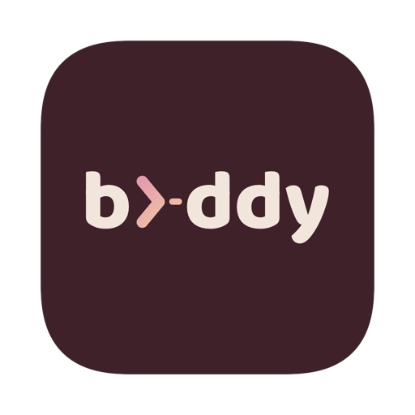
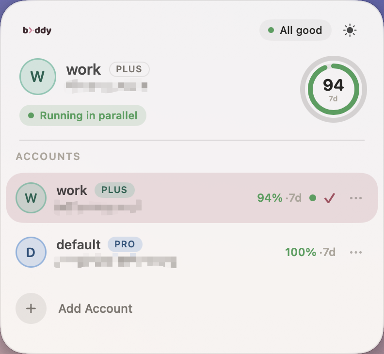
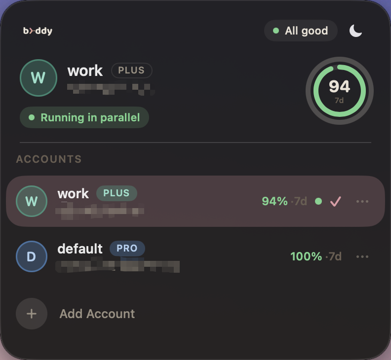
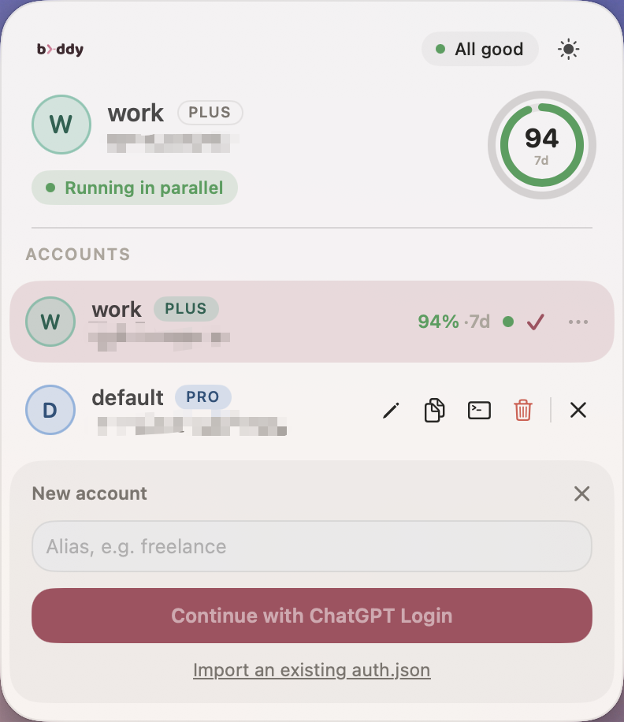

<p align="center">
  
</p>

<h1 align="center">codex-buddy</h1>

<p align="center">
  A <b>tiny, fast</b> way to run multiple <a href="https://developers.openai.com/codex">Codex CLI</a> accounts in parallel —<br/>
  one <b>544 KB</b> binary, switch or run side by side, no re-logins, local by default.
</p>

<p align="center">
  
  
  
  
</p>

<p align="center">
  <b>English</b> | <a href="README.zh-CN.md">简体中文</a> | <a href="README.es.md">Español</a>
</p>

## Features

- **Tiny & fast** — a single 544 KB binary, just 4 direct dependencies, zero async / zero HTTP /
  zero crypto. Switching accounts is an atomic `rename` (**instant**); probing which accounts are
  running in parallel uses a native syscall (~**2 ms**). The release binary is squeezed with
  `opt-level=z` + `lto` + `strip`.
- **True parallel accounts** — actually run two or more Codex sessions **at the same time**, each
  under its own account, fully isolated.
- **Never triggers a re-login** — switch back and forth as much as you want; no forced logout, no
  risk of tripping anti-abuse detection.
- **Local by default** — no telemetry, and a CLI with zero network code. Live usage is strictly
  opt-in, and even then the fetching is done by codex itself — see
  [Live usage](#live-usage-optional). The menu bar app's only own network call is the update
  check you trigger yourself.
- **Safe by design** — setup backs up your existing login before touching it and rolls back on
  any failure; a one-command `doctor` check tells you if anything's off.
- **Shared config, isolated logins** — `config.toml` and rules apply to every account; credentials
  never leak between them.

## Menu bar app

Beyond the CLI, codex-buddy ships a native macOS menu bar app: click the icon and a panel shows
each account's usage, which one is active, and which are running in parallel — one click to switch.
**Just as tiny** — a single-arch app bundle is well under a megabyte.

<p align="center">
  
  
</p>

- **Usage rings** — how much is left in each rate-limit window codex reports, color-coded by
  threshold.
- **Live usage (opt-in)** — the bolt in the header enables fetching current numbers through codex
  when the panel opens (throttled, parallel per account); local data stays the fallback. Off by
  default.
- **Account list** — per-account candy-color avatar, plan badge, parallel-running green dot, and a
  checkmark on the active one.
- **Built-in Doctor** — self-check right in the panel; it expands a list only when something's off,
  with one-click copy of the report.
- **Light / dark** — follows the system, or toggle light / dark yourself.
- **Inline actions + Add account** — a row of icons per account to rename, copy `CODEX_HOME`, run
  in Terminal, or remove; "Add Account" expands in place, driving a real `codex login` or importing
  an existing `auth.json`.

<p align="center">
  
</p>

- **Menu bar status item** — see the active account and its tightest usage percentage without even
  opening the panel, color-coded by threshold.

<p align="center">
  
</p>

Download the app from [Releases](https://github.com/CodePrometheus/codex-buddy/releases):
`Codex-Buddy-arm64-macOS.zip` for Apple Silicon, `Codex-Buddy-x86_64-macOS.zip` for Intel. It's
unsigned, so the first launch needs a right-click → Open.

## Install

**Homebrew.**

```sh
brew install CodePrometheus/tap/codex-buddy
```

**Shell script.** Downloads a prebuilt binary, no Homebrew needed:

```sh
curl --proto '=https' --tlsv1.2 -LsSf https://github.com/CodePrometheus/codex-buddy/releases/latest/download/codex-buddy-installer.sh | sh
```

Both need Apple Silicon or Intel macOS; see [Releases](https://github.com/CodePrometheus/codex-buddy/releases) for prebuilt binaries and checksums.

## Quick start

```
$ codex-buddy init
Detected current account:
  email : alice@work.example
  plan  : plus

Alias for this account [work]:
...
Done: account 'work' is managed and set as current.

$ codex-buddy add personal
Opening codex login for 'personal'; complete the login in your browser...
...
Account 'personal' added. Use `codex-buddy switch personal`, or `codex-buddy run personal -- ...`
to run it in parallel.

$ codex-buddy list
  ALIAS     EMAIL                   PLAN  1W        LAST USED
* work      alice@work.example      plus  12% (4d)  just now
  personal  alice@personal.example  pro   0% (6d)   2d ago

$ codex-buddy switch personal
Switched to: personal  alice@personal.example  [pro]

$ codex
# starts immediately, no login prompt

$ codex-buddy switch -
Switched to: work  alice@work.example  [plus]
```

Run two accounts side by side without switching either one:

```
# terminal 1
$ codex-buddy run work -- codex

# terminal 2
$ codex-buddy run personal -- codex
```

## Commands

**Setup**

| Command | Description |
|---|---|
| `init [alias] [--yes]` | Adopt the current `~/.codex` account |
| `add <alias>` | Log in and adopt a new account |
| `import <auth.json> [--alias a] [--json]` | Import one account |
| `import <directory> [--skip-existing] [--json]` | Import immediate `<alias>/auth.json` children; successful items are kept |
| `export <alias> <path> [--force]` | Export one credential file with `0600` permissions |
| `relogin <alias>` | Re-login an existing account (e.g. after token expiry) |
| `rename <old> <new>` | Rename an account |
| `remove <alias> [--yes]` | Remove an account (refuses to remove the active one) |

**Use**

| Command | Description |
|---|---|
| `list [--json]` | List accounts with usage |
| `current [--json]` | Show the active account |
| `usage [alias] [--remote] [--json]` | Show usage and whether it is fresh, expired, or missing |
| `recommend [--remote] [--json]` | Recommend the account with the most headroom |
| `switch <alias> \| - \| --next` | Switch account (`-` = previous, `--next` = cycle in registry order) |
| `run <alias> -- <args>` | Run codex under an account, in parallel |
| `path <alias>` | Print an account's `CODEX_HOME` |
| `doctor [--json]` | Check setup health |
| `report [--json]` | Summarize accounts and health checks |

Usage tables show a column per rate-limit window actually present in the data — codex's window
set has changed upstream before, so nothing is hardcoded.

Directory import deliberately scans one level only:

```
accounts/
├── work/auth.json
└── personal/auth.json
```

Each account is committed independently. The command prints `imported`, `skipped`, or `failed`
for every item, keeps successful imports, and exits non-zero if any item failed.
`--skip-existing` only skips an existing alias with the same account identity; it never replaces
credentials.

Exported `auth.json` files contain access and refresh tokens. codex-buddy creates them as `0600`,
refuses symlink and managed `~/.codex-buddy` destinations, and requires `--force` to replace an
existing regular file.

Codex must be storing your login as a plain file, not in the system keychain — codex-buddy
manages that file directly, so it needs it on disk. `init` and `add` check this automatically and
tell you how to fix it (`cli_auth_credentials_store = "file"` in `~/.codex/config.toml`) if not.

## Live usage (optional)

By default every number codex-buddy shows comes from local session data: correct as of the last
time that account ran codex, and labeled `fresh` / `expired` / `missing` honestly. When you want
current numbers instead:

```
$ codex-buddy usage --remote
  ALIAS     STATUS  1W
  work      fresh   15% (5d)
  personal  fresh   6% (4d)

$ codex-buddy recommend --remote
Recommended: personal
  bottleneck: 1w with 94% remaining
  1w: 6% used, 94% remaining, resets in 4d
```

`--remote` asks codex itself: codex-buddy starts `codex app-server` under each account's
`CODEX_HOME`, reads that account's rate limits over its stdio protocol, and stops it. The network
request is made by the official codex binary — its own client, its own auth, its own token
refresh. codex-buddy never talks to any backend directly, holds no HTTP code, and sends nothing
anywhere; that stays true with `--remote`.

The menu bar app has the same switch behind the bolt icon ("Live usage via codex"), off by
default and persisted once you flip it.

## License

[MIT License](LICENSE)
